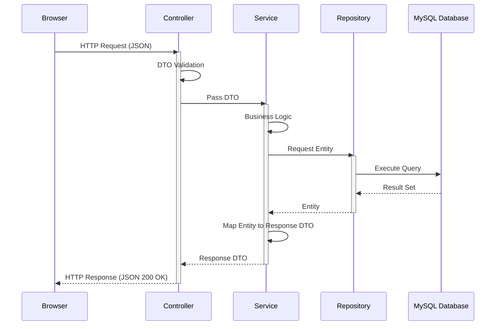

```markdown
# VERITAS CHAMBERS: SYSTEM ARCHITECTURE
**Target Agent:** Google Antigravity
**Document Scope:** High-Level Technical Architecture & System Design

================================================================================
## ARCHITECTURAL OBJECTIVE
================================================================================
The objective is to design a system architecture for the Veritas Chambers website that is:
*   Simple enough for a professional legal practice website.
*   Structured enough for secure, production-grade deployment.
*   Maintainable by a single human developer or AI coding agent.
*   Easy to test and locally debug.
*   Secure against common web vulnerabilities.
*   Modular within a single monolithic application boundary.
*   Consistent with standard Spring Boot conventions.
*   Highly resistant to unnecessary complexity (e.g., premature microservices).

================================================================================
## 1. ARCHITECTURAL OVERVIEW
================================================================================
The system is a Server-Side Monolithic Web Application exposing REST APIs to a Browser-based Frontend. 

**High-Level Data Flow:**
`Browser` 
↓ `Frontend (HTML/JS)` 
↓ `HTTP/REST` 
↓ `Spring Boot Application` 
↓ `Security (Authentication/Authorization Filter Chain)` 
↓ `Controllers (HTTP routing & input validation)` 
↓ `DTOs (Payload boundary)` 
↓ `Services (Business logic & transaction boundary)` 
↓ `Repositories (Data access abstraction)` 
↓ `JPA/Hibernate (ORM)` 
↓ `MySQL Database (Persistence)`

*   **Authentication & Authorization:** Handled at the Spring Security layer before reaching controllers.
*   **Validation:** Handled at the Controller boundary (Client payload) and Service layer (Business rules).
*   **Error Handling:** Centralized via ControllerAdvice.
*   **Configuration:** Externalized via environment variables and application properties.
*   **Content Management:** Orchestrated through protected Admin APIs writing to MySQL.

================================================================================
## 2. ARCHITECTURAL STYLE
================================================================================
**Style:** MODULAR MONOLITH + LAYERED (N-TIER) ARCHITECTURE

This architecture is appropriate because the domain (a legal firm's public presence and content management) has cohesive boundaries, single-database requirements, and does not require distributed scaling.

**Layers and Dependency Direction:**
`Controller` → `Service` → `Repository` → `JPA/Hibernate` → `Database`

*   **Controllers** must NOT directly access Repositories.
*   **Repositories** must NOT contain business logic.
*   **Entities** must NOT be leaked as public API payloads (DTOs are mandatory).
*   **Cross-cutting concerns** (Security, Logging, Exceptions) span layers but do not invert dependencies.

================================================================================
## 3. HIGH-LEVEL COMPONENT DIAGRAM
================================================================================
```mermaid
flowchart TD
    subgraph Client Tier
        PUB[Public Visitor Browser]
        ADM[Admin Browser]
    end

    subgraph Spring Boot Application
        SEC[Spring Security Filter Chain]
        
        subgraph Web Layer
            CTRL_PUB[Public REST Controllers]
            CTRL_ADM[Admin REST Controllers]
        end
        
        subgraph Business Layer
            SVC[Service Layer / Business Logic]
        end
        
        subgraph Data Access Layer
            REPO[Spring Data JPA Repositories]
        end
    end

    subgraph Database Tier
        DB[(MySQL 8.x)]
    end

    PUB -->|HTTP GET/POST| SEC
    ADM -->|HTTP (Authenticated)| SEC
    
    SEC --> CTRL_PUB
    SEC --> CTRL_ADM
    
    CTRL_PUB -->|DTOs| SVC
    CTRL_ADM -->|DTOs| SVC
    
    SVC -->|Entities| REPO
    REPO -->|Hibernate/JDBC| DB

```

================================================================================

## 4. SYSTEM BOUNDARIES

================================================================================

* **PUBLIC BOUNDARY:** Contains the public HTML website, public REST endpoints, contact/consultation form submissions, and published content (Articles, FAQs).
* **ADMIN BOUNDARY:** Contains admin authentication, the protected dashboard UI, content management workflows, and enquiry review systems.
* **DATA BOUNDARY:** The MySQL database. External access is strictly prohibited; it is accessible only by the Spring Boot backend.
* **SECURITY BOUNDARY:** Spring Security context enforcing that public users must never cross into administrative functionality without proper authorization tokens/sessions.

================================================================================

## 5. FRONTEND ARCHITECTURE

================================================================================
**Technologies:** HTML5, Bootstrap 5, Vanilla JavaScript.

* **Structure:** Standard HTML pages with Bootstrap for responsive grid and UI components.
* **Reusability:** Shared components/partials (e.g., Header, Footer) managed via backend templating (e.g., Thymeleaf) or static inclusion, avoiding redundant code.
* **CSS/JS Organization:** Modular CSS for brand overrides; distinct JS files per domain (e.g., `consultation-form.js`, `admin-dashboard.js`).
* **API Communication:** Handled via the native `Fetch API`.
* **State & UX:** Progressive enhancement. Vanilla JS manages loading states (spinners), form validation, and success/error states natively.
* *No frontend frameworks (React, Vue) are permitted.*

================================================================================

## 6. FRONTEND ↔ BACKEND COMMUNICATION

================================================================================
Communication occurs strictly over HTTP/REST.

**Request Flow:**
`Frontend (Fetch)` → `HTTP Request` → `REST Controller` → `Map to DTO` → `Validation` → `Service` → `Repository` → `Database`

**Response Flow:**
`Database` → `Repository` → `Entity` → `Service` → `Map to Response DTO` → `Controller` → `JSON/HTTP Response` → `Frontend (DOM Update)`

**Methods Used:**

* `GET`: Fetching pages, articles, practice areas.
* `POST`: Submitting consultations, logging in, creating content.
* `PUT/PATCH`: Updating content (Admin only).
* `DELETE`: Removing content/messages (Admin only).

*Note: Exact endpoints are defined in `API_CONTRACTS.md`.*

================================================================================

## 7. BACKEND ARCHITECTURE

================================================================================
Standardized Spring Boot package structure.

```text
com.veritaschambers
├── config       (Security, WebMvc, CORS configurations)
├── controller   (REST endpoints, HTTP request/response handling)
├── dto          (Data Transfer Objects for Request/Response payloads)
├── entity       (JPA/Hibernate domain models)
├── exception    (Global exception handlers, custom exceptions)
├── mapper       (Entity <-> DTO conversion logic)
├── repository   (Spring Data JPA interfaces)
├── security     (Authentication filters, UserDetails implementation)
├── service      (Business logic interfaces)
│   └── impl     (Service implementations)
└── validation   (Custom Jakarta bean validation annotations)

```

================================================================================

## 8. CONTROLLER LAYER

================================================================================
**Responsibilities:**

* Receive HTTP requests and extract path/query/body parameters.
* Validate Request DTOs using `@Valid`.
* Delegate execution to the Service Layer.
* Wrap Service responses in standard HTTP status codes (`ResponseEntity`).

**Prohibitions:**

* Controllers must NOT contain business logic.
* Controllers must NOT contain SQL or directly inject Repositories.
* Controllers must NOT leak JPA Entities.

================================================================================

## 9. DTO LAYER

================================================================================
**Purpose:** Create a resilient, secure boundary between the internal domain model and the external API contract.

* **Request DTOs:** Capture and validate input from clients.
* **Response DTOs:** Shape data returned to clients, stripping sensitive internal fields (e.g., password hashes, audit timestamps).
* **Benefit:** Allows the database schema to evolve independently of the public API contract.

================================================================================

## 10. SERVICE LAYER

================================================================================
**Responsibilities:**

* House 100% of the application's business rules.
* Define transaction boundaries (`@Transactional`).
* Orchestrate calls across multiple Repositories.
* Perform context-aware validation (e.g., checking if an email already exists).
* Transform Entities to DTOs (often utilizing the `mapper` package).

**Prohibitions:**

* Services must not contain HTTP-specific objects (e.g., `HttpServletRequest`).

================================================================================

## 11. REPOSITORY LAYER

================================================================================
**Responsibilities:**

* Abstract database operations using Spring Data JPA.
* Provide basic CRUD operations.
* Execute derived queries (e.g., `findBySlugAndStatus`).
* Execute custom JPQL/Native queries for complex data retrieval.

**Prohibitions:**

* Repositories must not contain business rules or data transformation logic.

================================================================================

## 12. ENTITY / PERSISTENCE LAYER

================================================================================
JPA Entities represent the structural persistence models mapping directly to MySQL tables.

**Architectural Domain Concepts (Subject to DB_SCHEMA.md):**

* `AdminUser`, `LawyerProfile`, `PracticeArea`
* `Consultation`, `ContactMessage`
* `Article`, `Category`, `FAQ`, `Testimonial`, `WebsiteSetting`

Entities encapsulate database state, relationship mappings (`@OneToMany`, etc.), and persistence constraints.

================================================================================

## 13. DATABASE ARCHITECTURE

================================================================================
**Stack:** `Spring Boot` → `Spring Data JPA` → `Hibernate` → `JDBC` → `MySQL 8.x`

* **Persistence Abstraction:** Hibernate handles dialect translation and ORM mapping.
* **Transactions:** Managed via Spring's declarative transaction management to ensure ACID compliance.
* **Connections:** HikariCP connection pooling (Spring Boot default).
* *Note: Database credentials are externalized. The precise schema resides in `DB_SCHEMA.md`.*

================================================================================

## 14. DOMAIN MODULES

================================================================================
The monolith is divided into logical, cohesive modules:

1. **Auth & Security:** Handles admin login, sessions/tokens, and RBAC.
2. **Lawyer Profile:** Manages Dhiraj Sawant's public biography and credentials.
3. **Practice Areas:** Directory and details of legal services offered.
4. **Consultations:** Intake and admin review of consultation requests.
5. **Contact Messages:** Intake and admin review of general inquiries.
6. **Legal Insights (Blog):** CMS for legal articles.
7. **Categories:** Taxonomy for Legal Insights.
8. **FAQs:** Operational questions and answers.
9. **Testimonials:** Client reviews (if approved for use).
10. **Settings:** Global configuration (Email, Phone, Hours).
11. **Admin Users:** Management of dashboard access.

================================================================================

## 15. PUBLIC WEBSITE MODULE

================================================================================

* **Responsibilities:** Serve the public HTML UI and public REST endpoints.
* **Rule:** The public module must only expose data explicitly marked as published. Draft articles, private consultation details, and admin settings must never be accessible from this module.

================================================================================

## 16. ADMIN MODULE

================================================================================

* **Workflow:** `Admin Login` → `Authentication` → `Authorization Token/Session` → `Admin Dashboard` → `Protected CRUD APIs`.
* **Security Rule:** Security must be enforced server-side via Spring Security rules (e.g., `@PreAuthorize("hasRole('ADMIN')")`). Simply hiding HTML elements on the frontend is not architecture; it is merely UX.

================================================================================

## 17. AUTHENTICATION ARCHITECTURE

================================================================================

* **Provider:** Spring Security.
* **Flow:** Admin submits credentials → Spring Security validates against DB via `UserDetailsService` → Issues Session Cookie (or JWT) → Client includes token in subsequent requests.
* **Password Hashing:** `BCryptPasswordEncoder` (Mandatory).
* **Constraints:** No hardcoded passwords. Credentials must be seeded securely and changed on deployment. Refer to `SECURITY_RULES.md`.

================================================================================

## 18. AUTHORIZATION ARCHITECTURE

================================================================================

* **Role-Based Access Control (RBAC):** Implementation of a primary `ADMIN` role.
* **Access Rules:** Public endpoints (`/api/public/**`) permit all traffic. Admin endpoints (`/api/admin/**`) require the `ADMIN` role.
* *If additional roles (e.g., EDITOR) are unnecessary for MVP, they will not be invented.*

================================================================================

## 19. REQUEST LIFECYCLE

================================================================================



================================================================================

## 20. CONSULTATION FLOW

================================================================================
**Public Submission:**
`Visitor` → `Consultation Form UI` → `Vanilla JS Validation` → `POST /api/public/consultations` → `Request DTO Validation` → `Consultation Service` → `Repository` → `MySQL Insert` → `201 Created` → `UI Success State`.

**Admin Review:**
`Admin Dashboard UI` → `GET /api/admin/consultations` → `Service` → `Repository` → `MySQL` → `Response DTO List` → `Admin UI Table`.

================================================================================

## 21. CONTACT MESSAGE FLOW

================================================================================
**Public Submission:**
`Visitor` → `Contact Form UI` → `POST /api/public/contact` → `Service` → `MySQL Insert` → `201 Created`.

**Security Constraint:** Private contact submissions must NEVER be exposed via `GET /api/public/...` endpoints.

================================================================================

## 22. CONTENT MANAGEMENT FLOW

================================================================================
**Lifecycle:**
`Admin` → `Login` → `Dashboard` → `Create/Edit Content (e.g., Article)` → `POST/PUT /api/admin/articles` → `Service Validation (e.g., Slug uniqueness)` → `MySQL Insert/Update` → `Status: PUBLISHED` → `Immediately available to GET /api/public/articles`.

================================================================================

## 23. VALIDATION ARCHITECTURE

================================================================================
**Client-Side Validation (Vanilla JS):**

* Provides immediate UX feedback and basic format checking (required fields, email regex).

**Server-Side Validation (Spring Boot):**

* **Authoritative.** The backend never trusts the client.
* Utilizes Jakarta Bean Validation (`@NotBlank`, `@Email`, `@Size`) on Request DTOs.
* Services enforce complex business validation (e.g., "Cannot publish an article without a category").

================================================================================

## 24. ERROR HANDLING ARCHITECTURE

================================================================================

* Centralized via `@RestControllerAdvice`.
* Standardized JSON error response structure containing `timestamp`, `status`, `error`, `message`, and `path`.
* Validation errors return `400 Bad Request` with field-specific details.
* **Security Rule:** Stack traces, SQL exceptions, or internal server details must NEVER be leaked to the client.

================================================================================

## 25. EXCEPTION ARCHITECTURE

================================================================================

* Use standard HTTP-mapped exceptions: `ResourceNotFoundException` (404), `UnauthorizedException` (401), `ForbiddenException` (403).
* Use custom business exceptions (`BusinessValidationException`) for logical failures.
* The `@RestControllerAdvice` class catches these and maps them to the standardized error DTO.

================================================================================

## 26. TRANSACTION MANAGEMENT

================================================================================

* Managed at the Service layer using Spring's `@Transactional`.
* Ensures that if a multi-step database operation fails (e.g., saving an Article and its associated Tags), the entire operation rolls back.
* Transactions should be kept short to avoid locking database resources.

================================================================================

## 27. DATA FLOW AND ENTITY EXPOSURE

================================================================================
**ANTI-PATTERN PROHIBITION:**
`Controller` → `Entity` → `JSON` is strictly prohibited.

**REQUIRED FLOW:**
`Repository` → `Entity` → `Service` → `Map to Response DTO` → `Controller` → `JSON`

**Justification:** Exposing Entities directly creates tight coupling between the database schema and the API contract, risks accidental exposure of sensitive fields (like passwords or internal IDs), and leads to Jackson serialization loops (`LazyInitializationException`).

================================================================================

## 28. SECURITY ARCHITECTURE

================================================================================

* **Framework:** Spring Security.
* **Protection:** CSRF protection enabled (or appropriately handled if using stateless tokens), CORS configured to restrict allowed origins.
* **Input:** All user input must be validated and sanitized to prevent XSS. Prepared statements via Hibernate natively prevent SQL Injection.
* **Data Protection:** Admin boundaries strictly enforced. Sensitive data kept behind authenticated routes.

================================================================================

## 29. CONFIGURATION ARCHITECTURE

================================================================================
Configuration, environment variables, and code are strictly separated.

* `application.yml`: Contains base application settings.
* Environment Variables (`${DB_PASSWORD}`, `${JWT_SECRET}`): Used for all sensitive secrets and environment-specific database URLs.
* **Never hardcode secrets** into Java classes or YAML files committed to Git.

================================================================================

## 30. ENVIRONMENT ARCHITECTURE

================================================================================

* **Development:** Local machine. Mock data allowed. Debug logging enabled.
* **Testing:** Automated CI environments. Synthetic test data.
* **Staging:** (If applicable) Production-like configuration. Securely isolated.
* **Production:** Publicly facing. Verified data only. Strict security rules. No development banners or mock placeholders permitted.

================================================================================

## 31. LOGGING AND OBSERVABILITY

================================================================================

* **Framework:** SLF4J / Logback.
* **Log Levels:** `INFO` for application lifecycle, `WARN`/`ERROR` for exceptions, `DEBUG` restricted to development environments.
* **Security Rule:** Passwords, authentication secrets, API keys, and sensitive client consultation data must NEVER be logged.

================================================================================

## 32. AUDITABILITY

================================================================================
At a conceptual level, critical tables (e.g., `Articles`, `PracticeAreas`) should implement basic audit fields:

* `created_at`
* `updated_at`
* `created_by` (Optional for MVP, useful if multiple admin users exist).
* No complex enterprise event-sourcing or heavy audit-log tables are required unless specifically justified.

================================================================================

## 33. PRIVACY ARCHITECTURE

================================================================================

* **Data Minimization:** Only collect necessary fields in Consultation/Contact forms.
* **Purpose Limitation:** Use collected data solely for responding to inquiries.
* **Access Control:** Only authenticated `ADMIN` users may access inquiry data.
* **Secure Storage:** No unnecessary exposure or secondary logging of inquiry payloads.

================================================================================

## 34. API ARCHITECTURE

================================================================================

* **RESTful Principles:** Resource-oriented URIs (e.g., `/api/public/practice-areas`).
* **HTTP Verbs:** Strict adherence to semantic meaning (GET = Read, POST = Create, PUT = Update, DELETE = Remove).
* **Payloads:** JSON format strictly enforced for request/response bodies.
* **Contracts:** Defined definitively in `API_CONTRACTS.md`.

================================================================================

## 35. API VERSIONING

================================================================================

* To avoid premature complexity, the MVP APIs will reside under a standard `/api/v1/...` path.
* Future breaking changes will require a `/v2/` increment to ensure backwards compatibility if third-party integrations are ever added.

================================================================================

## 36. FRONTEND COMPONENT/ASSET ORGANIZATION

================================================================================
(Aligned with `FOLDER_STRUCTURE.md`)

* `src/main/resources/static/css/` - Brand and layout styles.
* `src/main/resources/static/js/` - Vanilla JS modules (separated by page/concern).
* `src/main/resources/static/images/` - Optimized static assets.
* `src/main/resources/templates/` - HTML files.

================================================================================

## 37. BACKEND PACKAGE ORGANIZATION

================================================================================

```text
com.veritaschambers
├── config        (Spring Configuration classes)
├── controller    (REST Controllers)
├── dto           (Request/Response Records or POJOs)
├── entity        (JPA Models)
├── exception     (GlobalExceptionHandler, Custom exceptions)
├── mapper        (DTO/Entity converters)
├── repository    (Spring Data JPA interfaces)
├── security      (Auth filters, UserDetails)
├── service       (Business logic interfaces & implementations)
└── validation    (Custom validators)

```

*(Refer to `FOLDER_STRUCTURE.md` for the authoritative physical layout).*

================================================================================

## 38. DEPENDENCY RULES

================================================================================

* `Controller` depends on `Service`.
* `Service` depends on `Repository`.
* `Repository` depends on `Entity`.
* **Strict Prohibitions:** Controllers must not query the database. Repositories must not call Controllers. The frontend must never bypass the backend to access MySQL.

================================================================================

## 39. CACHING STRATEGY

================================================================================

* **Initial Architecture:** No caching infrastructure (No Redis, No Memcached). The database is performant enough for a standard professional website.
* **Future:** Application-level caching (Spring `@Cacheable`) may be introduced later if traffic necessitates it.

================================================================================

## 40. FILE AND IMAGE HANDLING

================================================================================

* **Static Assets:** Brand logos and UI icons are served statically from the Spring Boot resources folder.
* **Dynamic Uploads (Future/Optional MVP):** If the Admin panel supports uploading lawyer photos or article images, they will be stored locally in a secure, non-executable directory, or handled via standard BLOB storage. No external cloud providers (AWS S3) are architected for the MVP.

================================================================================

## 41. EMAIL/NOTIFICATION BOUNDARY

================================================================================

* If email notifications (e.g., "New Consultation Received") are implemented, they act as an integration boundary handled by a dedicated `NotificationService`.
* The service delegates to standard JavaMailSender. SMTP credentials must be externalized via environment variables.

================================================================================

## 42. SEARCH ARCHITECTURE

================================================================================

* **Initial Architecture:** Simple SQL `LIKE` queries or basic JPA indexing for Article/Practice Area searches.
* **Prohibition:** Do not introduce Elasticsearch, Solr, or external search engines for the MVP.

================================================================================

## 43. SCALABILITY STRATEGY

================================================================================
The modular monolith scales efficiently by running multiple instances of the stateless Spring Boot application behind a load balancer, pointing to the same MySQL database.

* Keep services stateless.
* Ensure efficient database indexing.
* Avoid premature distributed architectures (Microservices).

================================================================================

## 44. RELIABILITY

================================================================================

* **Graceful Errors:** The API must return standard JSON errors, not HTML stack traces, if a database failure occurs.
* **Transactions:** Ensure data consistency during multi-table writes.
* **Forms:** Vanilla JS will disable submit buttons upon click to prevent accidental duplicate consultation submissions.

================================================================================

## 45. PERFORMANCE ARCHITECTURE

================================================================================

* **Frontend:** Minified assets, minimal JS payload, optimized image formats (WebP).
* **Backend:** Pagination applied to list endpoints (Articles, Inbox) to prevent memory exhaustion on large datasets.
* **Database:** Strategic indexes on frequently queried columns (e.g., slugs, email, status).

================================================================================

## 46. TESTING ARCHITECTURE

================================================================================

* **Unit Tests (JUnit/Mockito):** Isolate and test Service layer business logic.
* **Repository Tests (`@DataJpaTest`):** Verify custom queries and persistence.
* **Controller Tests (`@WebMvcTest`):** Verify HTTP routing, validation, and JSON serialization.
* **Integration Tests:** Verify the full slice from Controller to Database (usually using an H2 in-memory database).

================================================================================

## 47. DEPLOYMENT BOUNDARY

================================================================================
The entire application (Frontend static files + Backend Java code) compiles into a single executable `.jar` file via Maven.
Deployable to any standard VPS/Server running a JRE, connecting to a local or remote MySQL instance. *(Refer to `MAVEN_GIT_DEPLOY.md` for exact procedures).*

================================================================================

## 48. ARCHITECTURAL DECISION RECORDS (ADR)

================================================================================

* **ADR-001:** *Use a modular monolith.* (Reason: Simplest path to production for a small team/AI; consequence: Cannot scale individual domains independently, which is fine for this traffic profile).
* **ADR-002:** *Use Spring Boot.* (Reason: Enterprise stability and rapid API development).
* **ADR-003:** *Use MySQL.* (Reason: Mature relational DB matching the structured nature of legal content).
* **ADR-004:** *Use Spring Data JPA/Hibernate.* (Reason: ORM productivity and query abstraction).
* **ADR-005:** *Use Layered Architecture.* (Reason: Clean separation of HTTP, Business, and Data concerns).
* **ADR-006:** *Use REST APIs.* (Reason: Decouples frontend UX from backend processing).
* **ADR-007:** *Use Bootstrap 5 + Vanilla JS.* (Reason: Eliminates build-step complexity associated with React/Vue while delivering a fast, responsive UI).
* **ADR-008:** *Keep infrastructure simple.* (Reason: Prevents maintenance burden; avoids Redis/Kafka until actual scale justifies them).

================================================================================

## 49. ARCHITECTURAL TRADE-OFFS

================================================================================

* **Monolith vs. Microservices:** The monolith is vastly easier to deploy and test, trading off the ability to scale the Admin panel separately from the Public site.
* **Vanilla JS vs. React/Vue:** Vanilla JS ensures extreme longevity and zero dependency-chain rot, trading off component-based state abstraction.
* **MySQL + JPA vs. NoSQL:** Relational DB enforces strict schema integrity (crucial for business data), trading off schemaless flexibility.

================================================================================

## 50. ARCHITECTURAL ANTI-PATTERNS (PROHIBITED)

================================================================================

* **NO** Microservices without justification.
* **NO** Direct database access from the frontend.
* **NO** Business logic inside Controllers or Repositories.
* **NO** Exposing JPA Entities as API payloads.
* **NO** Hardcoded secrets.
* **NO** "God Classes" (e.g., a single Service handling everything).
* **NO** Premature caching or distributed architecture.

================================================================================

## 51. ARCHITECTURAL EVOLUTION

================================================================================
The architecture is designed to accommodate future, evaluated enhancements without a rewrite. Potential additions (only when explicitly approved): Client Portal, Document Management, Calendar/CRM Integrations, Advanced Analytics, and Application-Level Caching.

================================================================================

## 52. ARCHITECTURE VALIDATION CHECKLIST

================================================================================

* [ ] **Boundaries:** Layer boundaries and dependency directions are strictly respected.
* [ ] **Frontend:** Communicates only via REST APIs. No direct DB access.
* [ ] **Controllers:** Thin, focused solely on HTTP and validation.
* [ ] **Services:** Contain 100% of the business logic.
* [ ] **Security:** Enforced server-side. Secrets are externalized.
* [ ] **Data:** DTOs act as the strict API boundary. Sensitive fields are shielded.
* [ ] **Testing:** Architecture allows for isolated unit and integration testing.

================================================================================

## 53. SOURCE-OF-TRUTH RULE

================================================================================
`SYSTEM_ARCHITECTURE.md` is the authoritative source for high-level technical architecture.
It does **NOT** override:

* User's explicit current instructions.
* `CONSTRAINTS.md` (Hard constraints).
* `PRD_OVERVIEW.md` (Product requirements).
* `DB_SCHEMA.md` (Database structure).
* `API_CONTRACTS.md` (API details).
* `SECURITY_RULES.md` (Security implementation).
* `BRAND_AND_UI.md` (Visual design).
* `FOLDER_STRUCTURE.md` (File organization).
* `MAVEN_GIT_DEPLOY.md` (Deployment procedures).

If conflicts arise, follow the higher-priority requirement or ask for clarification.

================================================================================

## 54. DOCUMENT MAINTENANCE

================================================================================
Update this document ONLY when architectural styles, layer boundaries, major technologies, data-flow patterns, or deployment architectures fundamentally change. Do NOT update it for minor bug fixes, routine CRUD feature additions, or CSS/HTML refinements.

================================================================================

## 55. FINAL ARCHITECTURAL SUMMARY

================================================================================
The Veritas Chambers website is a Layered, Modular Monolithic Web Application. It pairs a lightweight, highly-performant HTML5/Vanilla JS Frontend with a robust Java/Spring Boot Backend. Data is persisted relationally in MySQL via Spring Data JPA. Public visitors interact with unrestricted endpoints, while Administrators access content-management APIs protected by server-side Spring Security. Data flows strictly from Controllers to Services to Repositories, ensuring business logic remains isolated, testable, and secure. DTOs form a non-negotiable boundary between the database and the public web. Complex distributed infrastructure is intentionally excluded to guarantee maintainability and reliability.

```

```