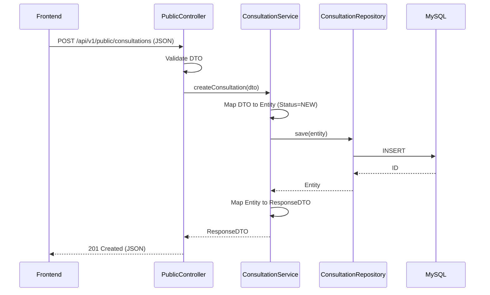

```markdown
# VERITAS CHAMBERS: API CONTRACTS
**Target Agent:** Google Antigravity
**Document Scope:** HTTP/REST API Definitions and Communication Contracts

================================================================================
## 1. API DESIGN OBJECTIVE
================================================================================
The Veritas Chambers API is a clean, predictable, and secure RESTful interface bridging the Vanilla JavaScript frontend and the Spring Boot backend. It is designed to be intentionally small, strongly validated, strictly segregated by access level, and completely decoupled from database implementation details (Entities).

================================================================================
## 2. API BOUNDARIES
================================================================================
The API is strictly divided into two distinct boundaries:

**1. PUBLIC API:**
*   Used by unauthenticated public visitors.
*   *Capabilities:* Read published content (Profile, Practice Areas, Articles, FAQs, Testimonials), submit Consultation Requests, and submit Contact Messages.
*   *Security:* Cannot access unpublished drafts, admin notes, or internal system data.

**2. ADMIN API:**
*   Used by authenticated administrators.
*   *Capabilities:* Full CRUD operations on all content resources, review of submitted inquiries, and management of global settings.
*   *Security:* Protected by Spring Security. Requires an active, authorized session/token.

================================================================================
## 3. BASE API PATH
================================================================================
**Base Path:** `/api/v1`

*Decision:* Versioning is applied consistently to all endpoints at the root level to allow for future backward-incompatible changes without breaking existing clients.
*   Public paths route to: `/api/v1/public/...`
*   Admin paths route to: `/api/v1/admin/...`
*   Auth paths route to: `/api/v1/auth/...`

================================================================================
## 4. REST RESOURCE NAMING
================================================================================
*   Use plural nouns for resources (e.g., `/articles`, `/consultations`).
*   Use `kebab-case` for multi-word resources (e.g., `/practice-areas`, `/contact-messages`).
*   Avoid verbs in paths (e.g., use `POST /articles` instead of `/create-article`).

================================================================================
## 5. HTTP METHODS
================================================================================
*   **GET:** Retrieve a resource or list of resources. Safe and idempotent.
*   **POST:** Create a new resource or submit a form payload.
*   **PUT:** Fully replace an existing resource.
*   **PATCH:** Partially update a resource (e.g., changing status).
*   **DELETE:** Remove or archive a resource.

================================================================================
## 6. HTTP STATUS CODE STANDARD
================================================================================
*   `200 OK`: Successful GET, PUT, PATCH, or DELETE (if returning data).
*   `201 Created`: Successful POST (returns the created resource).
*   `204 No Content`: Successful DELETE (when returning no data).
*   `400 Bad Request`: Validation failure or malformed JSON.
*   `401 Unauthorized`: Missing or invalid authentication token/session.
*   `403 Forbidden`: Authenticated, but lacks required permissions (e.g., not an ADMIN).
*   `404 Not Found`: Resource or slug does not exist.
*   `409 Conflict`: Business rule violation (e.g., duplicate slug).
*   `500 Internal Server Error`: Unexpected backend failure.

================================================================================
## 7. ERROR RESPONSE CONTRACT
================================================================================
All non-2xx responses MUST return this standardized JSON structure. Stack traces, SQL errors, and internal class names must NEVER be exposed.

```json
{
  "timestamp": "2026-08-19T10:00:00Z",
  "status": 400,
  "error": "VALIDATION_ERROR",
  "message": "Request validation failed.",
  "path": "/api/v1/public/consultations",
  "fieldErrors": [
    {
      "field": "email",
      "message": "Must be a well-formed email address."
    }
  ]
}

```

*Categories (`error` field):* `VALIDATION_ERROR`, `UNAUTHORIZED`, `FORBIDDEN`, `NOT_FOUND`, `CONFLICT`, `INTERNAL_SERVER_ERROR`.

================================================================================

## 8. VALIDATION CONTRACT

================================================================================
Server-side validation is authoritative. Client-side JS validation is UX-only.

* **Strings (General):** Trimmed, `NotBlank`. Max length typically 255.
* **Text Blocks:** Max length 10,000 to prevent payload abuse.
* **Email:** Strict RFC regex matching. Max length 255.
* **Phone:** Regex pattern allowing standard international and local formats. Max length 50.
* **Slugs:** Alphanumeric and hyphens only (`^[a-z0-9-]+$`).

================================================================================

## 9. PAGINATION, SORTING, FILTERING & SEARCH

================================================================================
**Pagination:** Applied to list endpoints. Uses Spring Data conventions.

* *Query Params:* `?page=0&size=10` (0-indexed). Max size: 100.
* *Response Wrapper:*

```json
{
  "content": [ { /* items */ } ],
  "page": 0,
  "size": 10,
  "totalElements": 45,
  "totalPages": 5
}

```

**Sorting:**

* *Query Param:* `?sort=createdAt,desc`
* *Behavior:* Invalid sort fields default to `createdAt,desc`.

**Filtering & Search:**

* *Query Params:* `?status=PUBLISHED&categorySlug=criminal-law`
* *Search:* `?q=property` (Searches title/content. No Elasticsearch; basic SQL `LIKE` is used).

================================================================================

## 10. CONTENT-TYPE & CORS CONTRACT

================================================================================

* **Content-Type:** `application/json` is the default and expected type for all requests and responses. (Multipart/form-data is deferred unless file uploads are explicitly built).
* **CORS:** If the frontend is served from the same origin as the Spring Boot backend, complex CORS config is avoided. If separated, strictly allow the frontend origin domain. No wildcard `*` with credentials.

================================================================================

## 11. DTO NAMING CONVENTIONS

================================================================================
JPA Entities must never reach the API. Use strict DTOs:

* **Requests:** `[Resource]CreateRequest` or `[Resource]UpdateRequest` (e.g., `ArticleCreateRequest`).
* **Responses:** `[Resource]Response` or `[Resource]SummaryResponse` (e.g., `ConsultationResponse`).

================================================================================

## 12. DATA EXPOSURE BOUNDARIES

================================================================================
**Public Data Exposure:** Public APIs return ONLY data intended for public consumption. Never expose password hashes, `admin_notes`, or content marked as `DRAFT` or `ARCHIVED`.
**Admin Data Exposure:** Admin APIs expose operational data but must never return password hashes.

================================================================================

## 13. API ENDPOINT CATALOG

================================================================================

| ID | Method | Endpoint | Purpose | Access |
| --- | --- | --- | --- | --- |
| AUTH-01 | POST | `/api/v1/auth/login` | Admin authentication | PUBLIC |
| AUTH-02 | POST | `/api/v1/auth/logout` | Terminate session | ADMIN |
| PUB-01 | GET | `/api/v1/public/lawyer-profile` | Get public profile | PUBLIC |
| PUB-02 | GET | `/api/v1/public/practice-areas` | List active areas | PUBLIC |
| PUB-03 | GET | `/api/v1/public/articles` | List published articles | PUBLIC |
| PUB-04 | GET | `/api/v1/public/articles/{slug}` | Get single article | PUBLIC |
| PUB-05 | GET | `/api/v1/public/faqs` | List active FAQs | PUBLIC |
| PUB-06 | POST | `/api/v1/public/consultations` | Submit inquiry | PUBLIC |
| PUB-07 | POST | `/api/v1/public/contact-messages` | Submit message | PUBLIC |
| PUB-08 | POST | `/api/v1/public/chat` | AI Chatbot interaction | PUBLIC |
| ADM-01 | GET | `/api/v1/admin/consultations` | List all inquiries | ADMIN |
| ADM-02 | PATCH | `/api/v1/admin/consultations/{id}` | Update status | ADMIN |
| ADM-03 | POST | `/api/v1/admin/articles` | Create article | ADMIN |
| ADM-04 | PUT | `/api/v1/admin/articles/{id}` | Update article | ADMIN |

*(Note: Full CRUD paths exist for Admin resources, abbreviated here for clarity. Antigravity must follow standard REST conventions for the remaining admin paths).*

================================================================================

## 14. ENDPOINT CONTRACTS (DETAILED)

================================================================================

### API-PUB-06 — Submit Consultation Request

**Method:** POST
**Path:** `/api/v1/public/consultations`
**Access:** PUBLIC
**Purpose:** Secure capture of prospective client legal inquiries.

**Request Body (`ConsultationCreateRequest`):**

```json
{
  "name": "Test User",
  "email": "testuser@example.invalid",
  "phone": "555-0199",
  "preferredContactMethod": "PHONE",
  "subject": "Property Dispute",
  "message": "I need assistance reviewing a commercial lease agreement."
}

```

**Validation:** `name`, `message` NotBlank. `email` Email format. `phone` Pattern.
**Success Response:** `201 Created`

```json
{
  "id": 101,
  "status": "NEW",
  "message": "Consultation request submitted successfully."
}

```

**Error Responses:** `400 Bad Request` (Validation Failed).

---

### API-PUB-08 — AI Chatbot Interaction

**Method:** POST
**Path:** `/api/v1/public/chat`
**Access:** PUBLIC
**Purpose:** Stateless interaction with the AI chatbot. Provides a safe boundary over `ChatService`.

**Request Body (`ChatRequest`):**

```json
{
  "messages": [
    {
      "role": "user",
      "content": "What are your office hours?"
    }
  ]
}
```

**Validation:** `messages` list must not be empty (max 10). Each `ChatMessage` must have a valid `role` (`user` or `assistant`) and `content` (max 1000 chars, not blank).
**Success Response:** `200 OK`

```json
{
  "reply": "Our office hours are Monday to Friday from 10:00 AM to 6:00 PM.",
  "requiresDisclaimer": false
}
```

**Error Responses:** `400 Bad Request` (Validation Failed), `429 Too Many Requests` (Rate limit exceeded), `503 Service Unavailable` (AI Provider unavailable).

---

### API-PUB-03 — List Published Articles

**Method:** GET
**Path:** `/api/v1/public/articles`
**Access:** PUBLIC
**Purpose:** Fetch paginated list of published Legal Insights.

**Query Parameters:**

* `page` (int, default 0)
* `size` (int, default 10)
* `categorySlug` (string, optional)

**Success Response:** `200 OK`

```json
{
  "content": [
    {
      "id": 42,
      "title": "Understanding Civil Litigation",
      "slug": "understanding-civil-litigation",
      "excerpt": "A brief overview of the civil process...",
      "category": { "name": "Civil Law", "slug": "civil-law" },
      "publishedAt": "2026-08-10T09:00:00Z"
    }
  ],
  "page": 0, "size": 10, "totalElements": 1, "totalPages": 1
}

```

*(Note: Excludes `content` body to keep payload small. Content is fetched via `PUB-04`).*

---

### API-AUTH-01 — Admin Login

**Method:** POST
**Path:** `/api/v1/auth/login`
**Access:** PUBLIC
**Purpose:** Authenticate admin user and establish session/token.

**Request Body (`LoginRequest`):**

```json
{
  "email": "admin@example.invalid",
  "password": "plainTextPasswordSubmittedViaHttps"
}

```

**Success Response:** `200 OK`
*(Returns a session cookie or JWT depending on the final security architecture setup, plus basic user info).*

```json
{
  "id": 1,
  "name": "Admin User",
  "role": "ROLE_ADMIN"
}

```

**Error Responses:** `401 Unauthorized` (Invalid credentials).

---

### API-ADM-03 — Create Article

**Method:** POST
**Path:** `/api/v1/admin/articles`
**Access:** ADMIN
**Purpose:** Create a new Legal Insight.

**Request Body (`ArticleCreateRequest`):**

```json
{
  "categoryId": 5,
  "title": "New Legal Precedents",
  "excerpt": "Summary of recent rulings.",
  "content": "<p>Detailed HTML content...</p>",
  "status": "DRAFT"
}

```

**Success Response:** `201 Created` (Returns full `ArticleResponse` including generated `slug` and `createdAt`).
**Error Responses:** `400 Bad Request`, `401 Unauthorized`, `403 Forbidden`, `404 Not Found` (If Category ID doesn't exist).

================================================================================

## 15. API SEQUENCE DIAGRAMS

================================================================================

### Public Consultation Flow



================================================================================

## 16. API SECURITY PRINCIPLES

================================================================================

* **Authentication:** Endpoints under `/api/v1/admin/**` MUST enforce authentication.
* **Authorization:** The currently defined role is `ADMIN`. All protected endpoints require this role.
* **Input Validation:** Strict DTO validation prevents malformed data and XSS payloads.
* **No DB Coupling:** JPA Entities are strictly prohibited from entering or leaving the API layer.
* `SECURITY_RULES.md` remains authoritative for the exact Spring Security filter chain setup.

================================================================================

## 17. ANTIGRAVITY INSTRUCTIONS & CHANGE MANAGEMENT

================================================================================
Google Antigravity must treat `API_CONTRACTS.md` as **authoritative**.

1. **Before implementing an endpoint:** Search this document. Verify the path, HTTP method, DTO shapes, and access levels.
2. **Do NOT:** Create duplicate endpoints, change paths casually, or expose database entities directly to save time.
3. **Changing Contracts:** If a requirement demands a payload change, Antigravity must update `API_CONTRACTS.md` first, ensure `DB_SCHEMA.md` supports the change, and then implement the code. Silent API changes are prohibited.

================================================================================

## 18. API CONTRACT VALIDATION CHECKLIST

================================================================================

* [ ] Public/Admin boundaries are strictly enforced by URL paths.
* [ ] No JPA Entities are exposed in any payload.
* [ ] DTOs are used for all request/response bodies.
* [ ] Error responses follow the standardized RFC-like format.
* [ ] Pagination is applied to all list endpoints.
* [ ] Endpoints do not leak sensitive PII or credentials.
* [ ] API functionality aligns precisely with `PRD_OVERVIEW.md` and `DB_SCHEMA.md`.

================================================================================

## 19. SOURCE-OF-TRUTH RULE

================================================================================
`API_CONTRACTS.md` is the authoritative source for HTTP paths, methods, DTO structures, status codes, and API-level validation.

It does **NOT** override:

* `CONSTRAINTS.md` (Hard tech constraints).
* `SYSTEM_ARCHITECTURE.md` (Overall layered design).
* `DB_SCHEMA.md` (Exact MySQL tables).
* `SECURITY_RULES.md` (Spring Security configuration).

Conflicts must be explicitly resolved before coding.

================================================================================

## 20. DOCUMENT MAINTENANCE

================================================================================
Update this document whenever an endpoint is added, removed, or its signature (Request/Response DTO shape, Status Codes, Query Params) materially changes. Do not update it for internal backend service refactoring that leaves the JSON contract untouched.

================================================================================

## 21. FINAL API SUMMARY

================================================================================

* **Style:** RESTful JSON APIs.
* **Base Path:** `/api/v1`
* **Boundaries:** `/api/v1/public/*` (Unauthenticated) and `/api/v1/admin/*` (Authenticated, Role-protected).
* **Data Strategy:** Strict Entity <-> DTO separation.
* **Error Handling:** Centralized, standardized JSON error format preventing stack trace leaks.
* **Pagination:** Standardized `page` and `size` query parameters.
* **Exclusions:** No GraphQL, no HATEOAS over-engineering, no file-upload APIs (unless explicitly approved later).

```

```