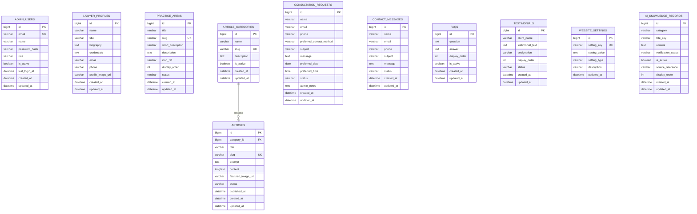

```markdown
# VERITAS CHAMBERS: DATABASE SCHEMA
**Target Agent:** Google Antigravity
**Document Scope:** MySQL Relational Database Architecture

================================================================================
## DATABASE OBJECTIVE
================================================================================
Design a normalized, maintainable MySQL 8.x relational schema tailored for a professional legal-practice website. The schema supports public content management (Lawyer Profiles, Practice Areas, Articles, FAQs) and secure client inquiry capture (Consultations, Contact Messages). 

**CRITICAL RULE:** This schema explicitly excludes full legal case-management entities (e.g., Court Cases, Client Legal Records, Invoices). It is a public presence and intake platform, not a law firm operational ERP.

================================================================================
## 1. DATABASE DESIGN PRINCIPLES
================================================================================
*   **Relational Modeling:** Utilize 3rd Normal Form (3NF) where practical.
*   **Referential Integrity:** Enforced via explicit Foreign Keys.
*   **Performance:** Strategic indexing on query-heavy columns (slugs, statuses, foreign keys).
*   **Data Integrity:** Strict `NOT NULL` constraints and application-level Enums mapped to `VARCHAR`.
*   **Maintainability:** Avoid premature complexity. No unnecessary polymorphic associations or EAV (Entity-Attribute-Value) anti-patterns.

================================================================================
## 2. DATABASE ENGINE AND CHARACTER SET
================================================================================
*   **RDBMS:** MySQL 8.x
*   **Storage Engine:** `InnoDB` (Mandatory for ACID compliance, row-level locking, and foreign key constraints).
*   **Character Set:** `utf8mb4` (Required for full Unicode support, including emojis and future Indian-language content).
*   **Collation:** `utf8mb4_unicode_ci` (or `utf8mb4_0900_ai_ci` in MySQL 8.0+ for accurate sorting and comparison).

================================================================================
## 3. PRIMARY KEY STRATEGY
================================================================================
*   **Strategy:** `BIGINT UNSIGNED AUTO_INCREMENT` for all tables.
*   **Justification:** Provides a virtually inexhaustible ID range (18 quintillion records), performs optimally in InnoDB B-Trees, and maps perfectly to `java.lang.Long` with JPA's `@GeneratedValue(strategy = GenerationType.IDENTITY)`.
*   **API Exposure:** IDs may be used internally and in admin routes. Public routes should prefer `slug` lookups (e.g., for articles and practice areas) to prevent enumeration attacks and improve SEO.

================================================================================
## 4. TIMESTAMP STRATEGY
================================================================================
*   **Fields:** `created_at` and `updated_at` on all entities.
*   **Type:** `DATETIME` (Preferable to `TIMESTAMP` to avoid the 2038 problem).
*   **Management:** Handled by JPA/Hibernate utilizing `@CreationTimestamp` and `@UpdateTimestamp` (or JPA Auditing `@CreatedDate`, `@LastModifiedDate`).
*   **Time Zone:** Stored in UTC. Application layer translates to IST (Indian Standard Time) for display.

================================================================================
## 5. SOFT DELETE & STATUS STRATEGY
================================================================================
*   **Strategy:** State Machine via `status` columns (`VARCHAR`) instead of a boolean `is_deleted` or timestamp `deleted_at`.
*   **Justification:** Content (Articles, Practice Areas) often requires a lifecycle: `DRAFT`, `PUBLISHED`, `ARCHIVED`. Enquiries require: `NEW`, `RESPONDED`, `CLOSED`. A `status` field unifies lifecycle management without overlapping "deleted" flags.
*   **Exception:** Hard deletion is permitted for Contact Messages if privacy policies mandate destruction after a certain period.

================================================================================
## 6. NAMING CONVENTIONS
================================================================================
*   **Tables:** Plural `snake_case` (e.g., `admin_users`, `practice_areas`).
*   **Columns:** Singular `snake_case` (e.g., `first_name`, `created_at`).
*   **Primary Keys:** `id` (Not `table_id`).
*   **Foreign Keys:** `singular_table_name_id` (e.g., `category_id`).
*   **JPA Mapping:** Automatically handled via Spring Boot's `SpringPhysicalNamingStrategy` (maps Java `camelCase` to DB `snake_case`).

================================================================================
## 7. CORE DOMAIN TABLES
================================================================================
Based on the approved scope, the schema consists of exactly 11 tables:
1. `admin_users`
2. `lawyer_profiles`
3. `practice_areas`
4. `consultation_requests`
5. `contact_messages`
6. `article_categories`
7. `articles`
8. `faqs`
9. `testimonials`
10. `website_settings`
11. `ai_knowledge_records`

================================================================================
## 8-17. TABLE SPECIFICATIONS
================================================================================
*(Detailed column definitions are cataloged in Section 40).*

*   **`admin_users`:** Stores authenticated dashboard users. Uses `password_hash` (BCrypt). No plaintext passwords.
*   **`lawyer_profiles`:** Single-row design initially, storing Dhiraj Sawant's bio and credentials. Designed to be updatable when `[MOCK]` placeholders are replaced.
*   **`practice_areas`:** Directory of legal services. Uses `slug` for SEO URLs.
*   **`consultation_requests`:** Secure capture of client legal inquiries.
*   **`contact_messages`:** Secure capture of general office/admin inquiries.
*   **`article_categories`:** Taxonomy for Legal Insights.
*   **`articles`:** Legal Insights CMS. Linked to categories.
*   **`faqs`:** Frequently Asked Questions, ordered by `display_order`.
*   **`testimonials`:** Client reviews (Status-controlled to prevent unauthorized publication).
*   **`website_settings`:** Key-Value store for global configs (e.g., Office Hours, Phone).
*   **`ai_knowledge_records`:** Dedicated factual knowledge base tailored for AI Chatbot context retrieval.

================================================================================
## 18. RELATIONSHIPS & CARDINALITY
================================================================================
*   `article_categories` (1) ───── (N) `articles`
    *   **Foreign Key:** `category_id` in `articles`.
    *   **Behavior:** Unidirectional from Article to Category is sufficient, though bidirectional is acceptable in JPA if needed.
*   **No other complex relationships are required for the MVP.** Keep it simple. Avoid M:N (Many-to-Many) junctions unless a new requirement dictates an article belongs to multiple categories.

================================================================================
## 20. FOREIGN KEY STRATEGY
================================================================================
*   **ON DELETE RESTRICT:** Used for `article_categories` -> `articles`. Deleting a category that contains articles will fail at the DB level. The admin must reassign or delete the articles first to prevent data orphaning.
*   **ON UPDATE CASCADE:** Standard safeguard for ID changes, though IDs should theoretically never change.

================================================================================
## 21. INDEX STRATEGY
================================================================================
*   **Primary Keys:** Automatically indexed.
*   **Foreign Keys:** Explicitly indexed to prevent table locks during JPA relationship updates.
*   **Slugs:** `UNIQUE INDEX` on `articles.slug`, `practice_areas.slug`, `article_categories.slug` for fast frontend routing.
*   **Status/Email:** Standard `INDEX` on `admin_users.email` and `consultation_requests.status` to speed up admin filtering.

================================================================================
## 22. UNIQUE CONSTRAINT STRATEGY
================================================================================
*   `admin_users.email` (Case-insensitive via collation)
*   `website_settings.setting_key`
*   `practice_areas.slug`
*   `articles.slug`
*   `article_categories.slug`

================================================================================
## 23. NULLABILITY
================================================================================
*   Use `NOT NULL` for all required application data (e.g., names, emails, titles).
*   Use `NULL` for genuinely optional data (e.g., `featured_image_url`, `admin_notes`).
*   Do not use empty strings `""` to represent missing data where `NULL` is semantically correct.

================================================================================
## 25. ENUM VS VARCHAR
================================================================================
*   **Decision:** Use `VARCHAR(50)` for all Status and Role fields.
*   **Justification:** Native MySQL `ENUM` columns require schema migrations (`ALTER TABLE`) to add new values, which is rigid and risky. JPA handles enums perfectly by mapping Java `enum` types to `VARCHAR` using `@Enumerated(EnumType.STRING)`. The application enforces the allowed values; the database merely stores the string.

================================================================================
## 26. SLUG STRATEGY
================================================================================
*   Generated at the Service layer (Application side) upon entity creation.
*   Must be URL-safe (lowercase, alphanumeric, hyphens).
*   Enforced as `UNIQUE VARCHAR(255)` at the database level.
*   Updates to Titles should *not* automatically update the slug to prevent breaking external inbound links, unless explicitly commanded by the admin.

================================================================================
## 27. CONTENT STATUS STRATEGY
================================================================================
Consistent values mapped to Java Enums:
*   **Content (Articles, Practice Areas, Testimonials):** `DRAFT`, `PUBLISHED`, `ARCHIVED`. (Only `PUBLISHED` content is fetched by Public APIs).
*   **Inquiries (Consultations, Contact):** `NEW`, `READ`, `RESPONDED`, `CLOSED`.

================================================================================
## 29. PRIVACY AND DATA MINIMIZATION
================================================================================
*   **Strict Minimization:** The schema only collects data strictly necessary for initial contact.
*   **Prohibitions:** Do NOT create columns for highly sensitive government identifiers (e.g., Aadhaar, PAN, SSN, RRN, MyNumber), bank details, or detailed legal evidence files.
*   If users supply sensitive data in the `message` text block, it remains there, but we do not actively schema-design to collect it.

================================================================================
## 31. MOCK DATA COMPATIBILITY
================================================================================
*   The schema accommodates `[MOCK]` tags as standard string inputs.
*   Nullability is relaxed on certain profile columns to allow iterative building as the user provides verified data.
*   `MOCK_DATA_STRATEGY.md` governs how this data is seeded and purged.

================================================================================
## 33. JPA/HIBERNATE MAPPING CONSIDERATIONS
================================================================================
*   **Lazy Loading:** Use `FetchType.LAZY` for all `@ManyToOne` and `@OneToMany` relationships to prevent N+1 query performance issues.
*   **No Entity Exposure:** Entities must be mapped to DTOs before leaving the Service layer.

================================================================================
## 38. COMPLETE ER DIAGRAM
================================================================================


================================================================================

## 39. COMPLETE TABLE CATALOG

================================================================================

| # | Table | Purpose | Primary Key | Important Relationships |
| --- | --- | --- | --- | --- |
| 1 | `admin_users` | Authenticated dashboard users | `id` | None |
| 2 | `lawyer_profiles` | Dhiraj Sawant's professional details | `id` | None |
| 3 | `practice_areas` | Services directory | `id` | None |
| 4 | `article_categories` | Taxonomy for insights | `id` | 1:N with `articles` |
| 5 | `articles` | Legal Insights CMS | `id` | N:1 with `article_categories` |
| 6 | `consultation_requests` | Secure lead capture | `id` | None |
| 7 | `contact_messages` | General inquiries | `id` | None |
| 8 | `faqs` | Frequently Asked Questions | `id` | None |
| 9 | `testimonials` | Client reviews | `id` | None |
| 10 | `website_settings` | Global KV config | `id` | None |
| 11 | `ai_knowledge_records` | Factual AI context | `id` | None |

================================================================================

## 40. COMPLETE COLUMN SPECIFICATION

================================================================================

### 1. admin_users

| Column | Type | Null | Default | Key | Description |
| --- | --- | --- | --- | --- | --- |
| `id` | BIGINT UNSIGNED | NO | AUTO_INCREMENT | PK | Unique ID |
| `email` | VARCHAR(255) | NO |  | UK | Login ID |
| `name` | VARCHAR(255) | NO |  |  | Admin display name |
| `password_hash` | VARCHAR(255) | NO |  |  | BCrypt hashed password |
| `role` | VARCHAR(50) | NO | 'ROLE_ADMIN' |  | RBAC mapping |
| `is_active` | BOOLEAN | NO | TRUE |  | Soft disable account |
| `last_login_at` | DATETIME | YES |  |  | Audit tracking |
| `created_at` | DATETIME | NO | CURRENT_TIMESTAMP |  |  |
| `updated_at` | DATETIME | NO | CURRENT_TIMESTAMP |  | On Update Current_Timestamp |

### 2. lawyer_profiles

| Column | Type | Null | Default | Key | Description |
| --- | --- | --- | --- | --- | --- |
| `id` | BIGINT UNSIGNED | NO | AUTO_INCREMENT | PK | Unique ID |
| `name` | VARCHAR(255) | NO |  |  | Full name |
| `title` | VARCHAR(255) | NO |  |  | Professional designation |
| `biography` | TEXT | YES |  |  | Detailed bio |
| `credentials` | TEXT | YES |  |  | Qualifications/Bar details |
| `email` | VARCHAR(255) | YES |  |  | Public display email |
| `phone` | VARCHAR(50) | YES |  |  | Public display phone |
| `profile_image_url` | VARCHAR(500) | YES |  |  | URI to headshot |
| `created_at` | DATETIME | NO | CURRENT_TIMESTAMP |  |  |
| `updated_at` | DATETIME | NO | CURRENT_TIMESTAMP |  |  |

### 3. practice_areas

| Column | Type | Null | Default | Key | Description |
| --- | --- | --- | --- | --- | --- |
| `id` | BIGINT UNSIGNED | NO | AUTO_INCREMENT | PK | Unique ID |
| `title` | VARCHAR(255) | NO |  |  | Area name |
| `slug` | VARCHAR(255) | NO |  | UK/IDX | URL friendly identifier |
| `short_description` | VARCHAR(500) | NO |  |  | Card display text |
| `description` | TEXT | YES |  |  | Full page content |
| `icon_ref` | VARCHAR(100) | YES |  |  | FontAwesome/Icon class |
| `display_order` | INT | NO | 0 |  | Custom sorting |
| `status` | VARCHAR(50) | NO | 'DRAFT' | IDX | DRAFT/PUBLISHED/ARCHIVED |
| `created_at` | DATETIME | NO | CURRENT_TIMESTAMP |  |  |
| `updated_at` | DATETIME | NO | CURRENT_TIMESTAMP |  |  |

### 4. article_categories

| Column | Type | Null | Default | Key | Description |
| --- | --- | --- | --- | --- | --- |
| `id` | BIGINT UNSIGNED | NO | AUTO_INCREMENT | PK | Unique ID |
| `name` | VARCHAR(255) | NO |  |  | Category name |
| `slug` | VARCHAR(255) | NO |  | UK/IDX | URL friendly identifier |
| `description` | TEXT | YES |  |  | Internal or SEO description |
| `is_active` | BOOLEAN | NO | TRUE |  | Toggle visibility |
| `created_at` | DATETIME | NO | CURRENT_TIMESTAMP |  |  |
| `updated_at` | DATETIME | NO | CURRENT_TIMESTAMP |  |  |

### 5. articles

| Column | Type | Null | Default | Key | Description |
| --- | --- | --- | --- | --- | --- |
| `id` | BIGINT UNSIGNED | NO | AUTO_INCREMENT | PK | Unique ID |
| `category_id` | BIGINT UNSIGNED | NO |  | FK/IDX | Ref `article_categories.id` |
| `title` | VARCHAR(255) | NO |  |  | Article title |
| `slug` | VARCHAR(255) | NO |  | UK/IDX | URL friendly identifier |
| `excerpt` | TEXT | YES |  |  | Summary for list views |
| `content` | LONGTEXT | NO |  |  | HTML or Markdown body |
| `featured_image_url` | VARCHAR(500) | YES |  |  | URI to header image |
| `status` | VARCHAR(50) | NO | 'DRAFT' | IDX | DRAFT/PUBLISHED/ARCHIVED |
| `published_at` | DATETIME | YES |  |  | Schedulable publish date |
| `created_at` | DATETIME | NO | CURRENT_TIMESTAMP |  |  |
| `updated_at` | DATETIME | NO | CURRENT_TIMESTAMP |  |  |

### 6. consultation_requests

| Column | Type | Null | Default | Key | Description |
| --- | --- | --- | --- | --- | --- |
| `id` | BIGINT UNSIGNED | NO | AUTO_INCREMENT | PK | Unique ID |
| `name` | VARCHAR(255) | NO |  |  | Client name |
| `email` | VARCHAR(255) | NO |  |  | Client email |
| `phone` | VARCHAR(50) | NO |  |  | Client phone |
| `preferred_contact_method` | VARCHAR(50) | YES |  |  | Phone/Email/WhatsApp |
| `subject` | VARCHAR(255) | YES |  |  | Optional legal matter type |
| `message` | TEXT | NO |  |  | Client explanation |
| `preferred_date` | DATE | YES |  |  | Requested consult date |
| `preferred_time` | TIME | YES |  |  | Requested consult time |
| `status` | VARCHAR(50) | NO | 'NEW' | IDX | NEW/CONTACTED/CLOSED |
| `admin_notes` | TEXT | YES |  |  | Private tracking notes |
| `created_at` | DATETIME | NO | CURRENT_TIMESTAMP |  |  |
| `updated_at` | DATETIME | NO | CURRENT_TIMESTAMP |  |  |

### 7. contact_messages

| Column | Type | Null | Default | Key | Description |
| --- | --- | --- | --- | --- | --- |
| `id` | BIGINT UNSIGNED | NO | AUTO_INCREMENT | PK | Unique ID |
| `name` | VARCHAR(255) | NO |  |  | Sender name |
| `email` | VARCHAR(255) | NO |  |  | Sender email |
| `phone` | VARCHAR(50) | YES |  |  | Sender phone |
| `subject` | VARCHAR(255) | YES |  |  | General subject |
| `message` | TEXT | NO |  |  | Message body |
| `status` | VARCHAR(50) | NO | 'NEW' | IDX | NEW/READ/RESPONDED |
| `created_at` | DATETIME | NO | CURRENT_TIMESTAMP |  |  |
| `updated_at` | DATETIME | NO | CURRENT_TIMESTAMP |  |  |

### 8. faqs

| Column | Type | Null | Default | Key | Description |
| --- | --- | --- | --- | --- | --- |
| `id` | BIGINT UNSIGNED | NO | AUTO_INCREMENT | PK | Unique ID |
| `question` | TEXT | NO |  |  | FAQ Question |
| `answer` | TEXT | NO |  |  | FAQ Answer |
| `display_order` | INT | NO | 0 |  | Custom sorting |
| `is_active` | BOOLEAN | NO | TRUE |  | Toggle visibility |
| `created_at` | DATETIME | NO | CURRENT_TIMESTAMP |  |  |
| `updated_at` | DATETIME | NO | CURRENT_TIMESTAMP |  |  |

### 9. testimonials

| Column | Type | Null | Default | Key | Description |
| --- | --- | --- | --- | --- | --- |
| `id` | BIGINT UNSIGNED | NO | AUTO_INCREMENT | PK | Unique ID |
| `client_name` | VARCHAR(255) | NO |  |  | Authorized name |
| `testimonial_text` | TEXT | NO |  |  | Review body |
| `designation` | VARCHAR(255) | YES |  |  | Company/Title if applicable |
| `display_order` | INT | NO | 0 |  | Custom sorting |
| `status` | VARCHAR(50) | NO | 'DRAFT' | IDX | DRAFT/PUBLISHED |
| `created_at` | DATETIME | NO | CURRENT_TIMESTAMP |  |  |
| `updated_at` | DATETIME | NO | CURRENT_TIMESTAMP |  |  |

### 10. website_settings

| Column | Type | Null | Default | Key | Description |
| --- | --- | --- | --- | --- | --- |
| `id` | BIGINT UNSIGNED | NO | AUTO_INCREMENT | PK | Unique ID |
| `setting_key` | VARCHAR(100) | NO |  | UK | e.g. 'OFFICE_PHONE' |
| `setting_value` | TEXT | YES |  |  | e.g. '+91 89835 12124' |
| `setting_type` | VARCHAR(50) | NO | 'STRING' |  | STRING/BOOLEAN/JSON |
| `description` | VARCHAR(255) | YES |  |  | Internal admin helper text |
| `updated_at` | DATETIME | NO | CURRENT_TIMESTAMP |  |  |

### 11. ai_knowledge_records

| Column | Type | Null | Default | Key | Description |
| --- | --- | --- | --- | --- | --- |
| `id` | BIGINT UNSIGNED | NO | AUTO_INCREMENT | PK | Unique ID |
| `category` | VARCHAR(100) | NO |  |  | Domain mapping (BIO, FAQ, etc) |
| `title_key` | VARCHAR(255) | NO |  |  | Contextual identifier |
| `content` | TEXT | NO |  |  | Verified text block |
| `verification_status` | VARCHAR(50) | NO | 'UNVERIFIED' | IDX | VERIFIED/UNVERIFIED |
| `is_active` | BOOLEAN | NO | TRUE | IDX | Enabled for AI context |
| `source_reference` | VARCHAR(255) | YES |  |  | Original source URL or doc |
| `display_order` | INT | NO | 0 |  | Fallback ordering |
| `created_at` | DATETIME | NO | CURRENT_TIMESTAMP |  |  |
| `updated_at` | DATETIME | NO | CURRENT_TIMESTAMP |  |  |

================================================================================

## 41. CONSTRAINT CATALOG

================================================================================

* **PK:** `id` is Primary Key on all tables.
* **FK:** `fk_articles_category` -> `articles(category_id)` references `article_categories(id)` `ON DELETE RESTRICT ON UPDATE CASCADE`.
* **UQ:** `uk_admin_email` -> `admin_users(email)`.
* **UQ:** `uk_practice_slug` -> `practice_areas(slug)`.
* **UQ:** `uk_category_slug` -> `article_categories(slug)`.
* **UQ:** `uk_article_slug` -> `articles(slug)`.
* **UQ:** `uk_setting_key` -> `website_settings(setting_key)`.

================================================================================

## 42. INDEX CATALOG

================================================================================

| Table | Index Name | Columns | Type | Purpose |
| --- | --- | --- | --- | --- |
| `articles` | `idx_articles_status` | `status` | BTREE | Fast filtering of published content |
| `practice_areas` | `idx_practice_status` | `status` | BTREE | Fast filtering of published content |
| `consultation_requests` | `idx_consult_status` | `status` | BTREE | Admin dashboard inbox filtering |
| `contact_messages` | `idx_contact_status` | `status` | BTREE | Admin dashboard inbox filtering |
| `articles` | `idx_articles_category_id` | `category_id` | BTREE | FK query performance |
| `ai_knowledge_records` | `idx_knowledge_verification` | `verification_status, is_active` | BTREE | AI context filtering |

================================================================================

## 44. DATABASE SECURITY BOUNDARY

================================================================================

* The MySQL database is located behind a strict network firewall, accepting connections ONLY from the Spring Boot application server (`localhost` or internal VPC IP).
* Public internet routing to port `3306` is prohibited.
* Frontend code (HTML/JS) has absolutely zero knowledge of database schemas, queries, or credentials.
* Database credentials must be provided to Spring Boot exclusively via secure environment variables (`SPRING_DATASOURCE_USERNAME`, `SPRING_DATASOURCE_PASSWORD`).

================================================================================

## 45. MIGRATION STRATEGY

================================================================================

* **Tooling:** While Flyway/Liquibase are standard, for this MVP, Spring Boot's native `spring.jpa.hibernate.ddl-auto` configured to `update` (in Dev) and `validate` (in Prod) is acceptable until formal migration tooling is requested.
* **Seed Data:** Managed via `data.sql` during the development phase.

================================================================================

## 46. DEVELOPMENT VS PRODUCTION DATABASE

================================================================================

* **Development:** Contains `[MOCK]` records, fake consultation requests, and a default admin user.
* **Production:** MUST start with a clean dataset. All `MOCK_` seeds must be disabled. The production DB must be seeded with a secure, newly hashed admin password generated exclusively for the production environment.

================================================================================

## 48. SOURCE-OF-TRUTH RULE

================================================================================
`DB_SCHEMA.md` is the authoritative source of truth for the exact relational database structure (Tables, Columns, Keys, Indexes).

It does **NOT** override:

* User's explicit instructions.
* `CONSTRAINTS.md`
* `PRD_OVERVIEW.md`
* `API_CONTRACTS.md` (owns JSON payloads, not DB tables)
* `SYSTEM_ARCHITECTURE.md`

If a REST API requirement asks for a field not present in this schema, propose a schema update rather than silently altering the entity or faking the data.

================================================================================

## 50. FINAL DATABASE DESIGN SUMMARY

================================================================================

* **Engine:** MySQL 8.x (InnoDB, `utf8mb4`).
* **Keys:** `BIGINT UNSIGNED AUTO_INCREMENT`.
* **Timestamps:** Standardized `created_at` and `updated_at`.
* **Core Tables:** 11 highly normalized tables securely supporting User Auth, Lawyer Profiles, Services, Blog CMS, Lead Intake, and AI Knowledge.
* **Lifecycle:** Managed via `VARCHAR` status fields mapped to Java Enums, avoiding strict boolean soft-deletes or rigid MySQL Enums.
* **Data Minimization:** No collection of sensitive government IDs or deep legal files.
* **Excluded:** Full legal case management, client portals, and billing tracking are intentionally omitted to preserve scope and maintainability.

```

```